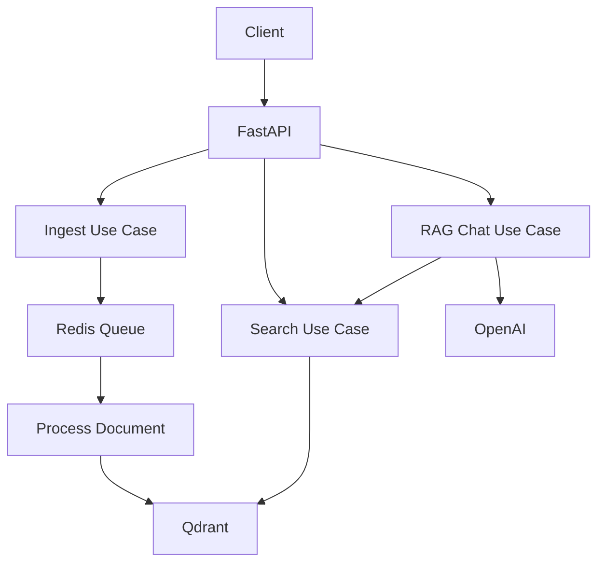

# AI Backend API

A production-grade AI Backend API with Retrieval-Augmented Generation (RAG) capabilities. Upload documents, search semantically, and chat with your knowledge base using streaming LLM responses.

## Architecture

```
FastAPI (API Layer)
    └── Application Use Cases
          ├── IngestDocument → Chunking → Embedding → Qdrant
          ├── SearchDocuments → Embedding → Qdrant semantic search
          └── RAGChat → Search → Context → OpenAI LLM → Stream
```



## Tech Stack

| Component | Technology |
|-----------|-----------|
| API framework | FastAPI + Python 3.13 |
| LLM / Embeddings | OpenAI GPT-4o + text-embedding-3-small |
| Vector store | Qdrant |
| Cache / Queue | Redis |
| Container | Docker + docker-compose |
| Infrastructure | Terraform + AWS ECS Fargate |

## Quickstart

### Prerequisites
- Docker + Docker Compose
- Python 3.13 (for local dev without Docker)
- OpenAI API key

### 1. Configure environment

```bash
cp .env.example .env
# Edit .env — set OPENAI_API_KEY, API_KEY at minimum
```

### 2. Start services

```bash
docker-compose up -d
```

This starts the API (`:8000`), Qdrant (`:6333`), and Redis (`:6379`).

### 3. Verify health

```bash
curl http://localhost:8000/health
# {"status":"healthy","version":"0.1.0","app_name":"AI Backend API"}
```

## API Usage

All endpoints require the `X-API-Key` header.

### Ingest a document

```bash
curl -X POST http://localhost:8000/api/v1/documents \
  -H "X-API-Key: $API_KEY" \
  -H "Content-Type: application/json" \
  -d '{
    "title": "About RAG",
    "content": "Retrieval-Augmented Generation combines retrieval and generation...",
    "collection_id": "00000000-0000-0000-0000-000000000001"
  }'
```

### Search documents

```bash
curl -X POST http://localhost:8000/api/v1/search \
  -H "X-API-Key: $API_KEY" \
  -H "Content-Type: application/json" \
  -d '{"query": "How does RAG work?", "top_k": 5}'
```

### Chat with RAG (streaming)

```bash
curl -X POST http://localhost:8000/api/v1/chat \
  -H "X-API-Key: $API_KEY" \
  -H "Content-Type: application/json" \
  -d '{"message": "Explain RAG in simple terms", "stream": true}'
```

## Development

```bash
# Install deps
poetry install

# Run tests
poetry run pytest tests/ -v --cov=app

# Run local dev server
make dev

# Format + lint
make format lint
```

## Environment Variables

See [`.env.example`](.env.example) for all available variables. Required:

| Variable | Description |
|----------|-------------|
| `OPENAI_API_KEY` | OpenAI API key |
| `API_KEY` | API authentication key |
| `REDIS_HOST` | Redis host (default: localhost) |
| `QDRANT_HOST` | Qdrant host (default: localhost) |

## Deployment

See [`terraform/`](terraform/) for AWS infrastructure code.

```bash
# 1. Bootstrap remote state (run once)
cd terraform/bootstrap && terraform apply

# 2. Deploy dev environment
cd terraform/environments/dev
terraform init && terraform apply
```
